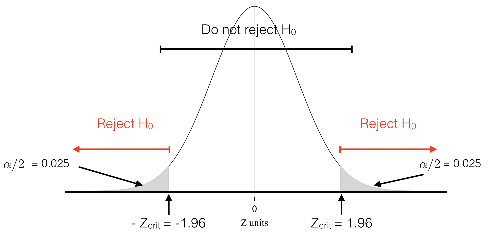

```{r setup, include=FALSE}
library(tufte)
library(knitr)
library(tidyverse)
library(kableExtra)
# invalidate cache when the tufte version changes
knitr::opts_chunk$set(tidy = FALSE, cache.extra = packageVersion('tufte'))
options(htmltools.dir.version = FALSE)
```


In this session^[Part of [Introduction to Statistical Learning in R](index.html) <a rel="license" href="http://creativecommons.org/licenses/by-nc-sa/4.0/"></a><br /><span xmlns:dct="http://purl.org/dc/terms/" property="dct:title"> Measuring Statistical Significance -- Hypothesis Testing & Confidence Intervals</span> by <a xmlns:cc="http://creativecommons.org/ns#" href="http://franciscorowe.com" property="cc:attributionName" rel="cc:attributionURL">Francisco Rowe</a> is licensed under a <a rel="license" href="http://creativecommons.org/licenses/by-nc-sa/4.0/">Creative Commons Attribution-NonCommercial-ShareAlike 4.0 International License</a>.], we move to examine some of the principles of *Inferential Statistics*. The previous sessions offered tools to descriptively profile our sample of data, understanding the distribution, composition, tendency and spread. For example, differences in unemployment rate across ethnic groups.

# Read data

```{r}
# clean workspace
rm(list=ls())
# load data
load("../data/data_qlfs.RData") 
```

# Percentage

A percentage comprises two parts: *numerator* and *denominator*.

$$\% = \frac{numerator}{denominator} \times 100$$
Let's have a look at employment status:

```{r}
attach(qlfs)
prop.table(table(WorkStatus)) * 100
```

Two-way cross tabulations:
```{r}
prop.table(table(WorkStatus, Sex), 1) * 100
```

**TASK #1** What is the percentage of female who are unemployed? How does this differ from the percentage above?
```{r, include=FALSE}
prop.table(table(WorkStatus, Sex), 2) * 100
```
# The Problem

What is the percentage of unemployment across ethnic groups?

First, identify the unemployed:
```{r}
qlfs <- qlfs %>% 
  # mutate() to create new variables
  mutate(unemp = ifelse(as.numeric(WorkStatus)== 5, "Yes", "No")) 
```
```{r}
attach(qlfs)
```

And then the percentage of unemployment by ethnic group:

```{r}
df_pune <- as.data.frame.matrix(prop.table(
  with(qlfs, table(EthnicGroup, unemp))
  , 1) * 100)
df_pune
df_pune$EthnicGroup <- rownames(df_pune)
```

Visually:
```{r, fig.margin = TRUE, fig.cap = 'Fig.1 % of unemployed by ethinicity'}
# get percentages
prc_df <- qlfs %>%
    filter(!is.na(unemp), !is.na(EthnicGroup)) %>%
    count(unemp, EthnicGroup) %>%
    group_by(EthnicGroup) %>%
    mutate(percent = (n / sum(n))*100) %>%
    ungroup() %>%
    filter(unemp=="Yes")
# plot
ggplot(data = prc_df, aes(y = EthnicGroup, x = percent)) +
     geom_point(stat = "identity") +
     # Add labels
    labs(title= paste(" "), x="% of Unemployed", y="Ethnic Group") +
    theme_classic() +
    theme(axis.text=element_text(size=14))
```

How do we know these percentages are statistically different if they are based on a random sample from a larger population? We are using estimates from a sample to make guesses about the population. Our sample estimates may similar or not to the population values. There is uncertainty due to *sampling error*. A different sample may produce different estimates. We know, however, that larger samples tend to produce more reliable sample estimates.

There are two issues then:

1) We don't know if our sample estimates are similar / close to the population values eg. gender composition.

2) We can't be certain if they are different.

To deal with these issues, we use two related approaches:

* Confidence Intervals

* Hypothesis Testing

**In this session, we cover the theory of hypothesis testing (though we will return to the practice of this when during the *regression analysis* session) and elaborate on confidence intervals which addresses the problem we are interested: assessing if percentages across groups are statistically different.**


# Confidence Intervals (CIs)

## The Theory

A confidence interval provides additional information on variability about the point estimate. 
A range of values for a population parameter are calculated using a single sample. 

A specific confidence interval will either contain or will not contain the population parameter.

We often use a 95% level of confidence (LOC): 95% of the time, the population parameter should lie within the confidence interval constructed around the sample mean...assuming that any difference between the sample estimate and the population parameter is attributable to random sampling error alone.

For example, our estimate of unemployment among Bangladeshi is 5.9% (23/391 x 100). This estimate has an associated 95% confidence interval of 3.6% to 8.2%. In other words, we are 95% sure that the % unemployed Bangladeshis in the population as a whole falls in the range 3.6% – 8.2%.

*Level of significance*:
$$ \alpha = {100\% - LOC} $$

So if 95%:

$$ 5\% = 100\% - 95\% $$

## CI Calculation

$$95\% \:CI = \pm 1.96 \times se(p)$$
where se(p) is the standard error of the sample estimate.

The formula for calculating the standard error for the sample estimate of a percentage is:
$$se(p) = \sqrt{ \frac {p \times (100-p)} {N} } $$
where `p` = the estimated percentage ( `numerator / denominator x 100`) and `N` = the size of the
denominator upon which the percentage is based.

For Bangladeshis who are unemployed:
```{r}
# recall the percentage
p <- prc_df[5,4]
p
```
```{r}
# denominator
NG <- qlfs %>%
      filter(!is.na(unemp), !is.na(EthnicGroup)) %>%
      count(EthnicGroup)
N <- NG[5,2]
```

```{r}
# standard error    
se <- ( (p * (100 - p)) / N)^0.5
se
```

```{r}
ci95_lb <- p - (1.96 * se)
ci95_ub <- p + (1.96 * se)
ci95_lb 
ci95_ub
```

## Comparing CIs

Calculating the 95% CI for one percentage is all well and good, but often we want to calculate and compare the 95% CIs for multiple percentages at the same time:

```{r, eval=TRUE, fig.margin = TRUE, fig.cap = 'Fig.2 CIs'}
p <- prc_df[,4]
se <- ((p * (100 - p)) / NG[,2])^0.5
ci95_lb <- p - (1.96 * se)
ci95_ub <- p + (1.96 * se)

prc_df <- data.frame(prc_df, ci95_lb, ci95_ub)
colnames(prc_df) <- c("unemp", "EthnicGroup", "n", "percent", "ci95_lb", "ci95_ub")

# plot
ggplot(data = prc_df, aes(y = EthnicGroup, x = percent)) +
     geom_point(stat = "identity") +
     geom_segment( aes( y = EthnicGroup, yend = EthnicGroup, x = ci95_lb, xend = ci95_ub) ) +
     # Add labels
    labs(title= paste(" "), x = "% of Unemployed", y = "Ethnic Group") +
    theme_classic() + 
      # Axis label size
    theme(axis.text=element_text(size=14))
```

We can draw various conclusions from this graph:

1) The narrower the confidence interval, the more confident we are about a given survey estimate.

2) We are more confident about the survey estimates of the unemployment rate for some ethnic groups than for others.

3) This is mainly a reflection of the size of the ethnic group sample. The fewer respondents from a given ethnic group in the survey, the wider the confidence interval.

4) If two confidence intervals overlap, then we can’t be 95% confident which unemployment rate is larger in the population as a whole eg. the survey estimate of the unemployment rate for Indians looks notably higher than the rate for the Chinese. However, since the confidence intervals overlap, we can’t be 95% confident that this is true in the population as a whole.

5) If two confidence intervals do not overlap, then we can be at least 95% confident that the one rate is higher than the other in the population as a whole eg. the 95% CIs of the survey estimates for the Black and Chinese unemployment rates do not overlap; therefore we are at least 95% confident that in the population as a whole the Black unemployment rate is higher than the Chinese unemployment rate.

# Hypothesis Testing

Hypothesis testing is used to formally validate / test a hypothesis ie. test if there is enough statistical evvidence for a claim. 

## The Theory

1) State your hypothesis eg. group percentages are equal. Two hypotheses:

  *Null hypothesis*: Claim or assumption to be tested eg. group percentages are equal

  *Alternative hypothesis*: Alternative claim if evidence doesn't support the null hypothesis eg. group percetanges are different, or smaller than, or greater than

2) Establish a decision rule based a LOC (or significance) eg. 95% (or 5%):

  No significant at 5%, if $|z|$ < 1.96 (or *p-value* $>$ 5%)

  Significant at 5%, if $|z| \ge$  1.96 (or *p-value* $\le$ 5%)
  
  *p-value: is the probability of an observed (or more extreme) result assuming that the null hypothesis is true. The smaller the p-value, the higher the significance indicating that the hypothesis under consideration may not adequately explain the observation.*

3) Compute the test statistic (z)

4) Interpretation / conclusion of the results



## Implementation

Testing the difference in unemployment between Chinese (3.5%) and Other Asian background (5.4%).
```{r}
# get n of unemployed people
n_une <- prc_df[6:7, 3]
# total population
n_pop <- as.numeric(unlist(NG[6:7, 2])) # unlist simplifies the structure of the data to produce a vector
prop.test(x = n_une, n = n_pop)
```

The output:

* the value of Pearson’s chi-squared test statistic.
* a p-value
* a 95% confidence intervals
* an estimated probability of success ie. the proportion of unemployed people in the two groups

The *p-value* of the test is 0.0.2125, which is greater than the significance level $\alpha$ = 0.05. We can conclude that the proportion of unemployed people between Chineses and Other Asian background are *not* significantly different.

This equivalent to the conclusion we would reach using CIs.

# Misuse of p-values

*p-values* are often used or interpreted incorrectly. There has been an intense debate to move beyond `p-value < 5%`. Read [here](https://doi.org/10.1038/d41586-019-00874-8), [here](https://doi.org/10.1126/science.aan7154), [here](https://doi.org/10.1038/d41586-019-00857-9), [here](https://doi.org/10.2307/2684655) and [here](https://doi.org/10.1080/00031305.2019.1583913).

Some common misunderstandings regarding *p-values*:

* The 0.05 significance level is arbitrary

* The p-value does not prove the null hypothesis is true - but indicates the degree of compatability between the dataset and the hypothesis

* The p-value does not indicate the size or importance of the observed effect

Solution: analyse data in multiple ways to see whether different analyses converge on the same answer: Logic, background knowledge and experimental design should be considered alongside P values and similar metrics to reach a conclusion and decide on its certainty.


# Appendix: Concepts and Functions to Remember

Function | Description
----------|---------------------------------------------
mutate() | create new variables
filter() | select observations based on their values
prop.table() | compute proportions
!is.na() | is not NA
%>% | pipe operator to chain functions together
group_by, ungroup | group/ungroup based on categorical variables
prop.test | test of equal or given proportions


