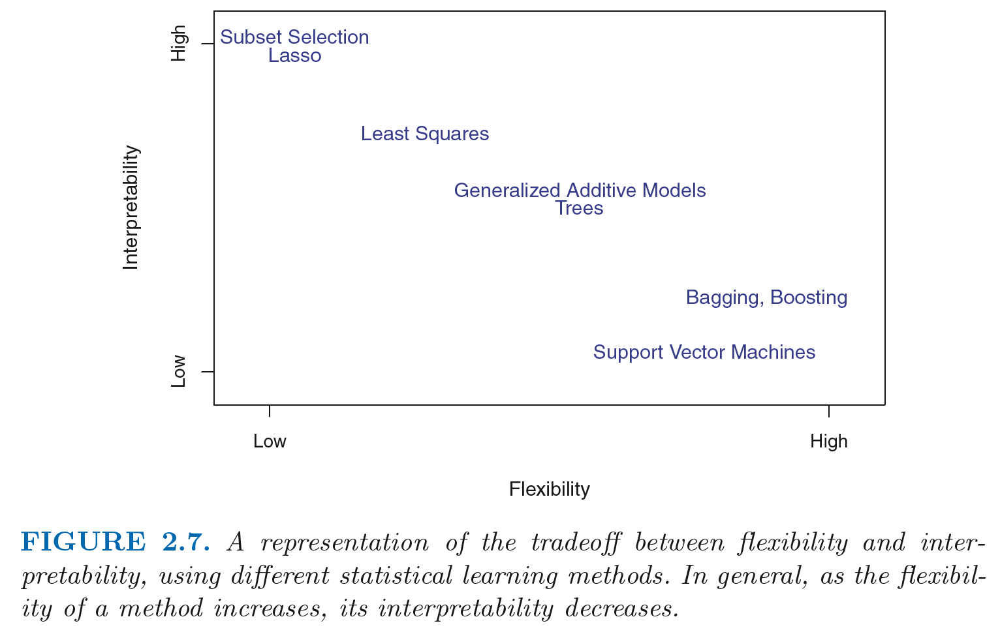
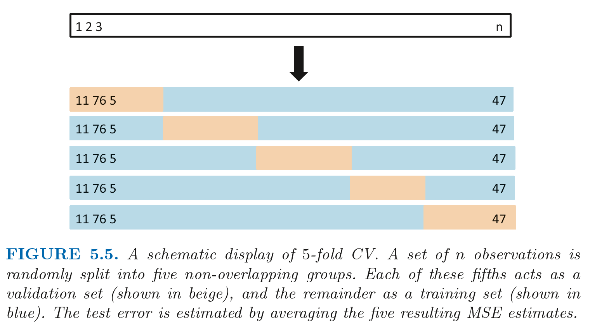

```{r setup, include=FALSE}
library(tufte)
library(knitr)
library(tidyverse)
library(kableExtra)
library(MASS) # store various datasets
library(ISLR) # store various datasets
library(tree) # performing regression and classification trees
library(randomForest) # performing regression and classification trees
library(boot) # provide functions for cross-validation
# invalidate cache when the tufte version changes
knitr::opts_chunk$set(tidy = FALSE, cache.extra = packageVersion('tufte'))
options(htmltools.dir.version = FALSE)
```

This session^[Part of [Introduction to Statistical Learning in R](index.html) <a rel="license" href="http://creativecommons.org/licenses/by-nc-sa/4.0/"></a><br /><span xmlns:dct="http://purl.org/dc/terms/" property="dct:title"> Supervised Machine Learning -- Tree Regressions, Random Forest & Cross-validation</span> by <a xmlns:cc="http://creativecommons.org/ns#" href="http://franciscorowe.com" property="cc:attributionName" rel="cc:attributionURL">Francisco Rowe</a> is licensed under a <a rel="license" href="http://creativecommons.org/licenses/by-nc-sa/4.0/">Creative Commons Attribution-NonCommercial-ShareAlike 4.0 International License</a>.] provides an introduction to supervised machine learning.

# What is Machine Learning?

Machine learning traces back to @Samuel_1959 and it is conceived as a subset of artificial intelligence. Machine learning algorithms build mathematical models based on sample data, in order to make predictions or decisions without being explicitly programmed to perform the task.

## Inference vs. Prediction

$$\hat{y} = \hat{f}(x) $$

*Prediction*: We are not concerned with the exact form of $\hat{f}$. It is treated as a black box. The interest is in accurate predictions.

*Inference*: We are interested in the form of $\hat{f}$ ie. the way $y$ is affected as $x$ changes. The goal is not necessarily to make predictions.

Machine learning revolves around the problem of *prediction*: produce predictions of $y$ from $x$. They are not built to understand the underpinning relationship between $y$ and $x$.

## Supervised vs Unsupervised Learning

*Supervised*: For each observation $i$ of the explanatory variable $x$, there is an associated response $y$.

*Unsupervised*: For each observation $i$ we observe measurements $x_{i}$ but *no* associated response $y$.

## Prediction Accuracy vs. Model Interpretability



## Regression vs. Classification

Regression problems ~ quantitative response variable

Classification problems ~ qualitative response variable

# Regression Trees

## The Idea

Regression trees partition a data set into smaller subgroups and then fit a simple constant for each observation in the subgroup. The partitioning is achieved by successive binary partitions based on the different predictors. Like for linear regression, these partitions are chosen minimising the $RSS$ (ie. minimising the total difference between the observed and predicted $y$). The constant to predict is based on the average response values for all observations that fall in that subgroup. To these ends, we train a model on a subset of our data in order to predict an unseen set of the sample.

*An example*: We want to predict individual's net pay income based on age (as a measured of experience) and sex (as a measure of gender discrimination in the labour market). We first remove observatins with missing and negative income values and log-transform NetPay in our QLFS data so its distribution has a more typical bell-shape.


```{r, eval=TRUE, echo=FALSE, fig.cap = 'Fig.2. A regression tree for predicting the log net pay of individuals based on age and gender. At a given internal node, the label ($X_{j} < t_P{k}$) indicates the left hand branch emanating from that split, and the right-hand branch corresponds to $X_{j} ≥ t_{k}$. The tree has three internal nodes and five terminal nodes, or leaves. The number in each leaf is the mean of the response for the observations. The terminal node indicates that the predicted ney pay for males aged < 23.5 is 5.241'}
# clean workspace
rm(list=ls())

# load data
load("../data/data_qlfs.RData")

# select variables to create a new df
df <- qlfs %>% 
  dplyr::select(NetPay, Sex, Age) %>%
  filter(!is.na(NetPay)) %>%
  filter(NetPay > 0)

# log-transform NetPay
df$NetPay <- log(df$NetPay)

# remove qlfs from the workspace
rm(qlfs)

# create training (70%) and test (30%) sets using `set.seed()` for reproducibility
# create an index variable to identify a training set
set.seed(123)
df_train <- sample(
  1:nrow(df),
  round(0.7* (nrow(df)))
  )

# fit regression tree
model1 <- tree(
  formula = NetPay ~ .,
  data    = df,
  method  = "recursive.partition",
  subset = df_train
  )

# plot the tree
plot(model1)
text(model1 ,pretty =0)
```

## Fitting Regression Trees

i) Read the data and create a dummy dataset:
```{r}
# clean workspace
rm(list=ls())

# load data
load("../data/data_qlfs.RData")

# select variables to create a new df
data <- qlfs %>% 
  dplyr::select(NetPay, Sex, Age) %>%
  filter(!is.na(NetPay)) %>%
  filter(NetPay > 0)

# log-transform NetPay
data$NetPay <- log(data$NetPay)

# remove qlfs from the workspace
rm(qlfs)
```


ii) Create training (70%) and test (30%) sets and use `set.seed()` for reproducibility
```{r}
# create an index variable to identify a training set
set.seed(123)
data_train <- sample(
  1:nrow(data),
  round(0.7* (nrow(data)))
  )
```

3) Fit a regression tree:
```{r}
# fit regression tree
m1_tree <- tree(
  formula = NetPay~.,
  data    = data,
  subset = data_train
  )
summary(m1_tree)
```

## Visualising the tree

```{r, fig.margin = TRUE, fig.cap = 'Replicating Tree above in Fig.2.'}
# plot the tree
plot(m1_tree)
text(m1_tree, pretty =0)
```

## Tuning

The process described above may produce good predictions on the training set, but it is likely to overfit the data, leading to poor test set performance. This is because the resulting tree might be too complex.

The key idea is to minimise the expected *test error*. Find a smaller tree with fewer splits that lead to lower variance and better interpretation at the cost of little bias ie. the right balance.

  * *Variance*: how the predictions would change if we change the training dataset. The idea is to find estimates which vary little between training datasets.
  * *Bias*: error introduced by approximating a real-life problem. The simpler the model, the greater the bias. 

To achive a good balance between variance and bias, a common approach is cost complexity *prunning*: grow a very long tree and then prune it back to obtain a subtree; that is, reduce the complexity of the tree finding the subtree that returns the lowest test error rate. We need to find the tuning parameter $a$ that penalises the tree complexity.

### Cost Complexity Prunning

1) Use k-fold cross validation to choose $a$. Note k = 10 is the default.
```{r}
cv_data <- cv.tree(m1_tree)
plot(cv_data$size, cv_data$dev, type = 'b')
```

2) We now prune the tree:
```{r, fig.margin = TRUE, fig.cap = 'Fig.3. Pruned tree using 3 branches'}
prune_data <- prune.tree(m1_tree, best=3)
plot(prune_data)
text(prune_data, pretty= 0)
```

## Prediction

To make predictions, we use the unpruned tree on the test dataset
```{r}
# predict net pay based on the training dataset
yhat <- predict(m1_tree, newdata= data[-data_train,])

# create indices for the test set
data_test= data[-data_train, "NetPay"]

# compute the mean squared error (MSE)
mse = mean((yhat- data_test)^2)
mse

# take the square root
sqrt(mse)
```

*Interpretation*: the test set MSE associated with the regression tree is 0.43. The square root of the MSE is therefore around 0.663, indicating that this model leads to test predictions that are within around £1.94 of the true median weekly net pay value.

# Random Forest

Decision trees suffer from high variance; that is, if we split the training data into two parts at random, and fit a decision tree to both halves, the results that we get could be quite different. Random Forest is well suited to reduce variance.

## The Idea

To take various training datasets, build separate prediction models and average the resulting predictions, in order to reduce the variance and increase the accuracy of predictions. Random Forest does this by using a *random sample of predictors* at each split in a tree. This enables decorrelating the trees.

## Fitting a Random Forest

i) Read the data and create a dummy dataset:
```{r}
# clean workspace
rm(list=ls())

# read 
load("../data/data_qlfs.RData")

# select variables to create a new df
data <- qlfs %>% dplyr::select(NetPay, FamilySize, Age, Sex, MaritalStatus, NSSEC, EthnicGroup, HighestQual, Tenure, TravelTime)  %>%
  filter(!is.na(NetPay)) %>%
  filter(NetPay > 0)

# log-transform NetPay
data$NetPay <- log(data$NetPay)

# remove qlfs from the workspace
rm(qlfs)
```

ii) Create training (70%) and test (30%) sets and use `set.seed()` for reproducibility
```{r}
# create an index variable to identify a training set
set.seed(123)
data_train = sample(
  1:nrow(data),
  round(0.7* (nrow(data)))
  )
```

3) Fit a random forest using 8 variables (usually $p/3$) at each split:
```{r}
# fit random forest
m1_rf <- randomForest(
  formula = NetPay ~ .,
  data    = data,
  subset = data_train,
  mtry = 3, 
  importance = TRUE,
  na.action=na.exclude
  )
```

## Prediction
```{r}
# predict net pay based on the training dataset
yhat_rf <-  predict(m1_rf, newdata= data[-data_train, ])

# create indices for the test set
data_test <- data[-data_train, "NetPay"]

# compute the mean squared error (MSE)
mse <- mean((!is.na(yhat_rf) - data_test)^2)
mse
```

#Conclusion: The test set MSE is 0.0003; this indicates that random forests yielded an improvement over regression trees.

## Importance

We can assess the importance of each variable.

```{r}
varImpPlot(m1_rf)
```


# Cross-validation

*Test Error*: Average error of predicting an observation based on a unseen test dataset ie. not used in the training dataset.

*Traning Error*:  Average error of predicting an observation included in the traning dataset.



*An example*:

Read data and create a training sample
```{r}
# read data
Auto <- Auto

# create training sample
set.seed (1)
train= sample(392 ,196)

```

Run a 10-fold cross-validation
```{r}
set.seed (17)
cv.error.10 = rep (0 ,10)
for (i in 1:10) {
  glm.fit <- glm(mpg ~ poly (horsepower, i), data = Auto)
  cv.error.10[i] = cv.glm(Auto, glm.fit, K = 10) $delta[1]
  }
cv.error.10
```


# Appendix: Concepts and Functions to Remember

Function | Description
----------|---------------------------------------------
sample() | create an index vector for a sample
set.seed() | set a seed number
tree() | fit a regression tree
plot(), text() | plot a tree
cv.tree() | preform k-fold cross-validation for trees
prune.tree() | prune a tree
predict() | generate predictions
cv.glm() | run cross-validation


